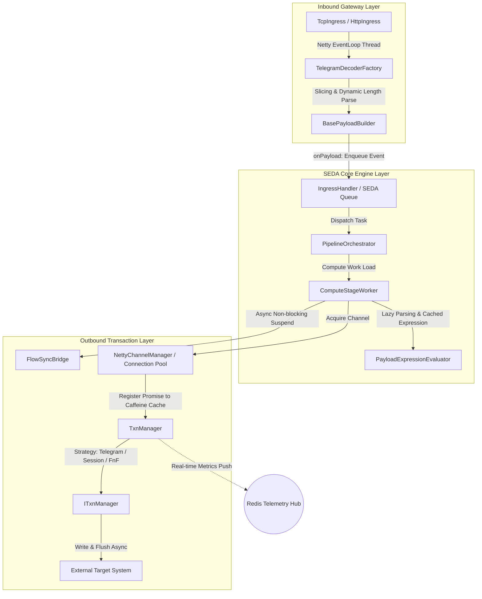

# Zefio Engine (Core Data Plane)


**Zefio Engine** is an enterprise-grade integration gateway and ultra-high-speed event mesh runtime engineered by combining the **Staged Event-Driven Architecture (SEDA)** pattern with a high-performance, asynchronous, non-blocking I/O backbone.

This engine serves as the **Data Plane** runtime environment designed to isolate and process high-density traffic streams, asynchronous transaction routing, and real-time edge telemetry without risking resource exhaustion. At bootstrap, it utilizes a **Self-Healing Webhook Handshake** mechanism to dynamically register its component schemas with the Control Plane. Following initialization, all real-time pipeline hot-reloads and remote orchestration directives are synchronized seamlessly across cluster nodes using Redis Pub/Sub as the communication bridge.

---

## 🚀 Key Features

* **SEDA-Driven Stage Isolation:** Strictly decouples CPU-bound workloads (`ComputeStageWorker`) from network-bound operations (`IoStageWorker` and Netty EventLoop groups) via physical transaction queues and dedicated thread pools. This architecture naturally prevents **thread starvation** during massive, unpredictable traffic spikes.
* **Declarative Template Pipelines:** Orchestrates complex business workflows, scatter-gather routines, try-catch scopes, and dynamic routing structures through highly readable YAML descriptors—requiring **zero code compilation** and eliminating system downtime.
* **Lossless MDC Trace Preservation:** Resolves the chronic context-loss vulnerabilities typical of non-blocking execution pipelines. Zefio automatically serializes and restores the **Mapped Diagnostic Context (MDC)** across all thread transitions and asynchronous handoff boundaries, guaranteeing end-to-end audit trails.
* **Polymorphic Transaction Lifecycle Management:** Dynamically selects the optimal runtime strategy based on your required `ExchangePattern`. Supports high-speed asynchronous fire-and-forget streams (`FireAndForget`), token-bound session state matching (`Session`), and SpEL-driven raw payload extraction (`Telegram`).
* **Pluggable Protocol Adapters:** Abstracts TCP (supporting fixed-length framing, custom delimiters, and dynamic length-field decoding), HTTP (REST), WebSockets, and Redis Pub/Sub streams straight into a unified core `Payload` object model for total format independence.
* **Self-Healing Bootstrap Handshake:** Proactively pushes local master templates, global variables, and plugin schemas to the Control Plane at startup. If the Control Plane is temporarily unreachable, an **intelligent exponential backoff retry loop** takes over until cluster alignment is secured.
* **Edge & Heterogeneous Optimization:** Features a lightweight footprint and efficient memory utilization layout, enabling identical Data Plane binaries to scale smoothly from high-availability cloud container infrastructures down to resource-constrained ARM-based IoT Edge devices like the Raspberry Pi.

---

## 🏗 Data Plane Pipeline Architecture

The lifecycle of an inbound physical byte packet passing through the SEDA stages and the asynchronous transaction management layer inside the Zefio core engine is mapped below:



---

## 🐳 Quick Start (Docker)

Zefio Engine includes a production-ready `entrypoint.sh` script that automatically detects the runtime JVM version (Java 8 to 21+) and intelligently tunes kernel memory allocation parameters alongside the Garbage Collector based on container cgroup limits.

### 1. Build the Image
```bash
# Clone the repository and navigate into the root directory
git clone [https://github.com/zefio-labs/zefio-engine.git](https://github.com/zefio-labs/zefio-engine.git)
cd zefio-engine

# Build the Docker container image
docker build -t zefio-engine:1.0.0 .
```

### 2. Run the Container
Inject `JAVA_OPTS` and runtime environment variables (`APP_ENV`) to fine-tune active cluster profiles and memory ceiling bounds.

```bash
docker run -d \
  --name zefio-edge-node \
  -p 52001-52020:52001-52020 \
  -e APP_ENV=prd \
  -e ZEFIO_NODE_ID=DP-01 \
  -e ZEFIO_NODE_GROUP=main \
  -e JAVA_OPTS="-Xms512m -Xmx512m -Djava.net.preferIPv4Stack=true" \
  zefio-engine:1.0.0
```

### 3. Verify Startup & Handshake Status
Monitor the container log output stream to verify the initialization of the dynamic JVM parameters and the successful execution of the self-healing bootstrap handshake with the Control Plane (CP).
```bash
docker logs -f zefio-edge-node
```
*Expected successful startup log output:*
```text
==================================================
🚀 Starting Zefio (K8s Mode: prd)
☕ Detected Java Version: 21.0.2 (JDK 21+)
📂 Log Directory: /Zefio/logs
⚙️ K8s Custom OPTS (Memory & ETC): -Xms512m -Xmx512m
==================================================
[DP-Handshake] Initializing CP handshake with URL: http://localhost:3000
[DP-Handshake] ✅ Successfully registered Master Templates to CP.
[Telemetry] Netty EventLoop State Tracker activated. Monitoring connection pools.
```

---

## ⚙️ Configuration

The engine reads `classpath:/composite.yaml` as its primary configuration layer on startup. Adjust the `cp` binding parameters below to align with your infrastructure environment to ensure real-time telemetry streaming and hot-reloads.

```yaml
zefio:
  node:
    id: ${ZEFIO_NODE_ID:DP-01}
    group: ${ZEFIO_NODE_GROUP:main}
  cp:
    enabled: true
    # 💡 The Control Plane webhook endpoint where the Data Plane pushes its bootstrap schemas
    api-url: ${ZEFIO_CP_API_URL:http://localhost:3000}
    redis:
      # 💡 The target Redis Cluster address for streaming live telemetry metrics and receiving hot-reload directives
      url: ${ZEFIO_REDIS_URL:redis://localhost:6379/0}
    metrics:
      push-interval-ms: 3000 # MicroMeter telemetry collation and dispatch frequency interval
```

---

## 🗺️ Roadmap to v1.0.0

Zefio is moving steadily through its public beta phases toward the official production-ready v1.0.0 stable release milestone.

- [x] **v0.8.0**: Established the SEDA Core runtime engine layout and verified distributed heterogeneous clustering capabilities (validated across ARM-based edge node clusters).
- [x] **v0.9.0**: Integrated the remote data plane orchestration layer and implemented the high-throughput Redis real-time telemetry streaming prototype.
- [x] **v1.0.0-RC (Current)**: Implemented **Zero-Downtime Hot Deployment** driven by Redis Pub/Sub orchestration bridges and deployed the millisecond-precision self-healing bootstrap handshake mechanism.
- [ ] **v1.0.0 (Stable)**: Announce the official open-source enterprise release and complete comprehensive end-to-end technical documentation audits.

---

## 🤝 Contributing

We welcome contributions from the open-source community to advance the Zefio runtime architecture! We are actively looking for pull requests and issue submissions focused on optimization of SEDA stage workers, custom legacy protocol adapter implementations, and expansion of asynchronous transaction recovery filters.

## 📄 License

This project is licensed under the terms of the **Apache License 2.0**. For complete details and copyright declarations, please review the accompanying [LICENSE](LICENSE) file.
